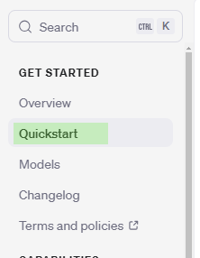

### OpenAI API Explorer 🤖

### Pre Requisitos 📋

1. Tener Python 3.7 o superior instalado.
2. Instalar `pip` si no está disponible.
3. Crear una cuenta en OpenAI y obtener una API key desde [OpenAI API](https://platform.openai.com/). 

### Instalación 🚀

1. Clonar repositorio
```bash
git clone https://github.com/EsthefanieHolguin/openai-explorer.git
cd openai-explorer
```
2. Crear entorno virtual
```bash
    python -m venv env
    venv\Scripts\activate
    python -m venv env
    venv\Scripts\activate
```
3. Instalar las siguientes dependencias de python
```bash
    pip install -r requirements.txt
```
4. Agregar mi api key en archivo `.env`:
5. Cargar la API key en mi script de Python:
    ```python
    from dotenv import load_dotenv
    import os

    load_dotenv()
    key = os.getenv("OPENAI_API_KEY")
    ```
```
